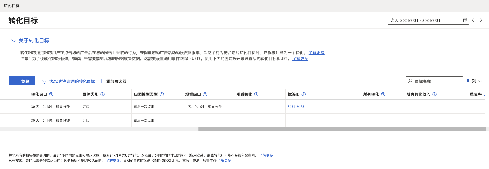
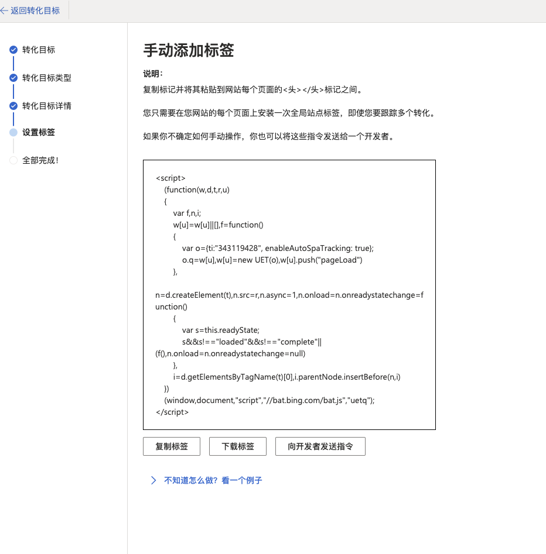
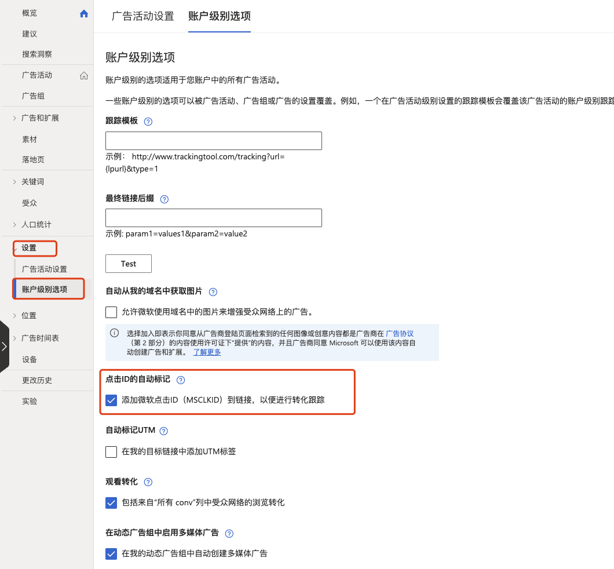
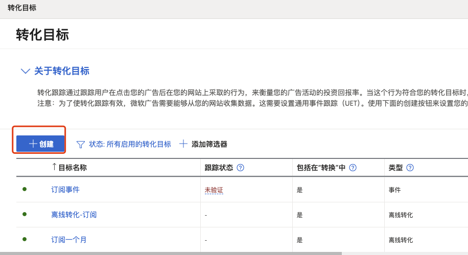
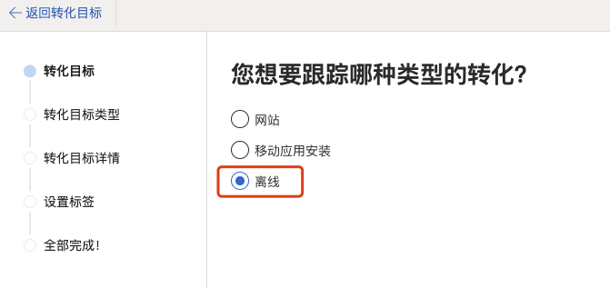
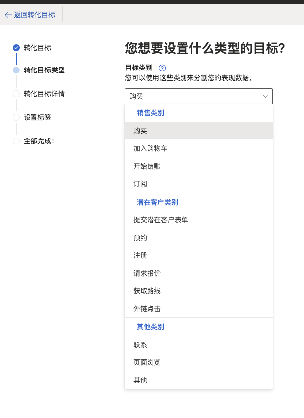
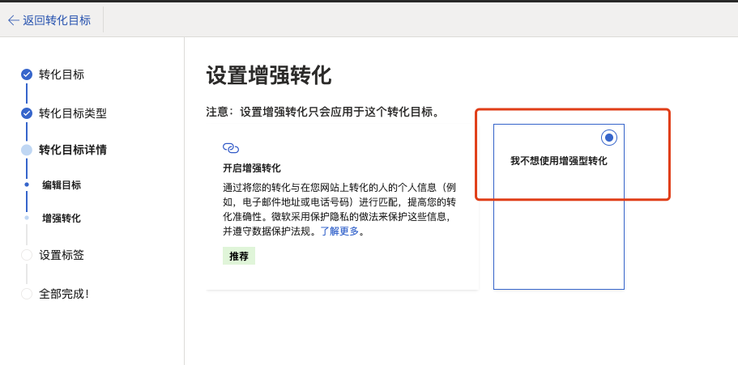

# Bing Ads API

请务必仔细阅读官方文档！API 文档地址：https://learn.microsoft.com/en-us/advertising/guides/?view=bingads-13

> 文档中可能有部分内容是过时的，或者未对中国用户做调整的地方，需对 API 进行仔细测试以甄别。

## 如何开始

文档地址：https://learn.microsoft.com/en-us/advertising/guides/get-started?view=bingads-13

### 注册一个 Web 应用程序

文档地址：https://learn.microsoft.com/en-us/advertising/guides/authentication-oauth-register?view=bingads-13

注意，需要放开权限，让「任何组织目录(任何 Microsoft Entra ID 租户 - 多租户)中的帐户和个人 Microsoft 帐户(例如 Skype、Xbox)」都有权限使用此应用。

重定向 URI 选择 Web 平台，输入一个 redirect_uri，比如 http://localhost:8080/auth

注册完成后，会得到 client_id 和 client_secret，以及一个自定义的 redirect_uri。

### 开发者令牌 developer_token

文档地址：https://learn.microsoft.com/en-us/advertising/guides/get-started?view=bingads-13#get-developer-token

在调用 Bing Ads API 时，不仅要拿到用户授权后的 access_token，还要用到开发者令牌 developer_token。

> 开发者令牌需要用户在微软 Ads 开发者门户页面上生成，只有超级管理员有权限生成这个，需联系一级代理商来生成。


### 获取 access_token、refrece_token

> 请注意，Bing Ads 提供了 Python、Java、PHP 和 C# 的 SDK，使用 SDK 可以很方便地实现用户授权、账户基建、数据回传等能力，无需额外开发。

> 接口文档地址：https://learn.microsoft.com/en-us/advertising/guides/authentication-oauth-consent?view=bingads-13

1. 构造链接格式为：`https://login.microsoftonline.com/common/oauth2/v2.0/authorize?client_id=xxxx-xxxx-xxxx-xxxx&response_type=code&redirect_uri=xxxxxx&response_mode=query&scope=openid offline_access https://ads.microsoft.com/msads.manage&state=12345`

其中，path 为 `/common/oauth2/v2.0/authorize`，这里跟文档中的例子不太一样，需要注意下，文档里也有解释：为了确保您的应用程序同时支持 MSA 个人账户和 Azure AD 工作或学校账户，我们建议您使用 common 作为 Bing Ads API 认证的租户。

`client_id` 为上一步获取到的client_id，

`redirect_uri` 为上一步注册应用程序时输入的 redirect_uri，注意这里的 uri 要以'/'结尾，在注册应用程序的时候可以不以'/'结尾，但这里构造授权链接的时候得加'/'。


2. 获取用户授权。将构造好的授权链接发给客户，客户点击链接后，会弹框提示是否将自己的 Ads 账户授权给这个应用程序，用户确认后，链接会跳转到 redirect_uri，并在 param 中带上一个 code，这个 code 是用于获取后续的 access_token 用的，code 有效期为 5min 左右，需服务端尽快拿这个 code 去获取 access_token。


相关代码:

```
# 请将以下参数修改为实际值
client_id = "xxxx-361b-4512-afbb-540d65d85104"
client_secret = "xxxx~HnxPcqQxv8bSxqCDrop1VQiaEUoOarJcxB"
redirection_uri = "xxxx" 
oauth_tokens = "xxxx468-494e-14e0-9ecd-7a495cdafd4c"

# 构造授权链接
url = f"https://login.microsoftonline.com/common/oauth2/v2.0/authorize?client_id={client_id}&response_type=code&redirect_uri={redirection_uri}&response_mode=query&scope=openid offline_access https://ads.microsoft.com/msads.manage&state=12345"

# 将构造出来的链接发送给用户，用户在浏览器访问打开，浏览器会重定向到一个新的链接，将这个新链接中的 code 记录下来

code = "xxxx"

# --- 获取 access_token 和 refresh_token ---

import requests


url = "https://login.microsoftonline.com/common/oauth2/v2.0/token" # 注意这里使用 common，不要使用 tenant

headers = {
    "Content-Type": "application/x-www-form-urlencoded"
}
data = {
    "client_id": client_id, 
    "scope": "https://ads.microsoft.com/msads.manage/offline_access",
    "code": code, # 用户同意授权给应用程序后，微软回调传的 code
    "redirect_uri": redirection_uri,
    "grant_type": "authorization_code",
    "client_secret": client_secret
}

# 发送 POST 请求
response = requests.post(url, data=data)

# 输出响应内容
print(response.text)

# 记录 response 中的 access_token 和 refresh_token

# --- 更新 access_token ---

import requests

url = "https://login.microsoftonline.com/common/oauth2/v2.0/token" # 注意这里使用 common，不要使用 tenant

headers = {
    "Content-Type": "application/x-www-form-urlencoded"
}
data = {
    "client_id": client_id,
    "scope": "https://ads.microsoft.com/msads.manage",
    "refresh_token": refresh_token,
    "grant_type": "refresh_token",
    "client_secret": client_secret
}

# 发送 POST 请求
response = requests.post(url, data=data)

# 输出响应内容
print(response.text)

# 记录 response 中新的 access_token

```

### 获取用户 Account ID 和 Customer ID

```
# 先通过 GetUser 获取 UserID

soap_request = f"""<soapenv:Envelope xmlns:soapenv="http://schemas.xmlsoap.org/soap/envelope/" xmlns:v13="https://bingads.microsoft.com/Customer/v13">
<soapenv:Header>
   <v13:DeveloperToken>{developer_token}</v13:DeveloperToken>
   <v13:AuthenticationToken>{access_token}</v13:AuthenticationToken>
</soapenv:Header>
<soapenv:Body>
   <v13:GetUserRequest>
      <v13:UserId xmlns:xsi="http://www.w3.org/2001/XMLSchema-instance" xsi:nil="true"/>
   </v13:GetUserRequest>
</soapenv:Body>
</soapenv:Envelope>"""

headers = {
    "SOAPAction": "GetUser",
    "Content-Type": "text/xml; charset=utf-8"
}

# 发送请求
uri = "https://clientcenter.api.bingads.microsoft.com/Api/CustomerManagement/v13/CustomerManagementService.svc"
response = requests.post(uri, data=soap_request, headers=headers)

# 输出响应内容
print(response.text)

# 输出结果中的 "s:Envelope"."s:Body".GetUserResponse.User."a:Id" 是 UserID.

# 通过 UserID 调用 SearchAccounts 获取 Account ID 和 Customer ID

userid = xxxxx

soap_request = f"""<s:Envelope xmlns:s="http://schemas.xmlsoap.org/soap/envelope/">
  <s:Header>
    <h:ApplicationToken i:nil="true" xmlns:h="https://bingads.microsoft.com/Customer/v13" xmlns:i="http://www.w3.org/2001/XMLSchema-instance" />
    <h:AuthenticationToken xmlns:h="https://bingads.microsoft.com/Customer/v13">{access_token}</h:AuthenticationToken>
    <h:DeveloperToken xmlns:h="https://bingads.microsoft.com/Customer/v13">{developer_token}</h:DeveloperToken>
  </s:Header>
  <s:Body>
    <SearchAccountsRequest xmlns="https://bingads.microsoft.com/Customer/v13">
      <Predicates xmlns:a="https://bingads.microsoft.com/Customer/v13/Entities" xmlns:i="http://www.w3.org/2001/XMLSchema-instance">
        <a:Predicate>
          <a:Field>UserId</a:Field>
          <a:Operator>Equals</a:Operator>
          <a:Value>{userid}</a:Value>
        </a:Predicate>
      </Predicates>
      <Ordering i:nil="true" xmlns:a="https://bingads.microsoft.com/Customer/v13/Entities" xmlns:i="http://www.w3.org/2001/XMLSchema-instance" />
      <PageInfo xmlns:a="https://bingads.microsoft.com/Customer/v13/Entities" xmlns:i="http://www.w3.org/2001/XMLSchema-instance">
        <a:Index>0</a:Index>
        <a:Size>10</a:Size>
      </PageInfo>
    </SearchAccountsRequest>
  </s:Body>
</s:Envelope>
"""

headers = {
    "SOAPAction": "SearchAccounts",
    "Content-Type": "text/xml; charset=utf-8"
}

# 发送请求
uri = "https://clientcenter.api.bingads.microsoft.com/Api/CustomerManagement/v13/CustomerManagementService.svc"
response = requests.post(uri, data=soap_request, headers=headers)

# 输出响应内容
print(response.text)

# 输出结果中的 "s:Envelope"."s:Body"."SearchAccountsResponse"."Accounts"."a:AdvertiserAccount"."a:Id" 是 Account ID
# 输出结果中的 "s:Envelope"."s:Body"."SearchAccountsResponse"."Accounts"."a:AdvertiserAccount"."a:ParentCustomerId" 是 Customer ID

```

### Demo

第一步，需要参考 https://github.com/wangbooth/BingAds-Python-SDK/blob/bing_cn/examples/v13/auth_helper.py，设置代码中的 CLIENT_ID、CLIENT_SECRET、REDIRECTION_URI 和 DEVELOPER_TOKEN 为实际值。

#### 账户基建 创建响应式搜索广告

可以参考 https://github.com/wangbooth/BingAds-Python-SDK/blob/bing_cn/examples/v13/responsive_search_ads.py，创建响应式搜索广告，实现账户基建工作。

#### 转化数据回传

# 转化跟踪

[转化跟踪](https://ui.ads.microsoft.com/campaign/vnext/conversiongoals?aid=176507923&ccuisrc=4&cid=253408536&uid=134481084)通过跟踪用户在点击您的广告后在您的网站上采取的行为，来衡量您的广告活动的投资回报率。当这个行为符合您的转化目标时，它就被计算为一个转化。




## 在线转化跟踪



在线转化跟踪，需要修改网站的代码，在网站的各个页面都插入 JavaScript 代码，在用户打开广告落地页时，JavaScript 程序将对应事件回传给 Bing。（不适合客户现状）


## 离线转化跟踪

离线转化跟踪无需修改网站代码，可由广告主自主控制何时将何数据回传给 Bing。

### MSCLKID

第一步，广告账户打开「点击 ID 的自动标记」：



此时，广告落地页的 URL 后会自动带上 MSCLKID 值，MSCLKID 是一个 32 位字符的全球唯一标识符，每次广告点击都是独一无二的，便于通过离线转化目标跟踪潜在客户。比如，原始的广告落地页 URL 设置为：`https://wenku.baidu.com/view/965197aa7cd184254b3535ee.html`，用户点击广告落地页时，跳转的链接为 `https://wenku.baidu.com/view/965197aa7cd184254b3535ee.html?msclkid=35b97407a01e114dbfd3120dd29e275c`

### 离线转化目标

创建离线转化目标：





目标类别可根据实际业务选择：




不要选择增强型转化，这个需要修改网站代码，不适合客户使用：



创建完成后，广告主后端可以通过[ApplyOfflineConversions API](https://learn.microsoft.com/en-us/advertising/campaign-management-service/applyofflineconversions?view=bingads-13) 来将订单或事件数据回传至Bing。

### API 调用回传离线转化数据

请求头数据准备：

- AuthenticationToken，广告账户 OAuth 认证过后的访问令牌
- CustomerAccountId，广告账户 ID
- CustomerId，客户 ID
- DeveloperToken，开发者令牌

请求数据准备：

- OfflineConversions
- - ConversionCurrencyCode， 转换货币代码，CNY
- - ConversionName，转化目标名称，在上一步创建的离线转化目标的名称
- - ConversionTime，转化发生的时间
- - ConversionValue，转化价值，可以是付款金额其他价值
- - MicrosoftClickId， MSCLKID

Python 代码示例：https://github.com/wangbooth/BingAds-Python-SDK/blob/bing_cn/examples/v13/offline_conversions.py


可以参考 [examples/v13/offline_conversions.py](https://github.com/wangbooth/BingAds-Python-SDK/blob/bing_cn/examples/v13/offline_conversions.py)，将转化数据回传至对应的转化目标。

## 账户基础数据报表 或 每日消费数据报表

### 第一步 通过 GetUser 获取 UserID
- 示例代码在上文相关代码处

### 第二步 通过 UserID 调用 SearchAccounts 获取 Account ID 和 Customer ID
#### 请求头数据准备：
- AuthenticationToken：广告账户 OAuth 认证过后的访问令牌
- DeveloperToken：开发者令牌

#### 请求数据准备：

- Ordering：排序规则
- PageInfo：每页结果的索引和大小。
- Predicates：返回帐户必须满足的所有条件。
- ReturnAdditionalFields：包含在每个返回帐户中的其他属性列表

示例代码在上文相关代码处

文档地址：https://learn.microsoft.com/en-us/advertising/customer-management-service/searchaccounts?view=bingads-13

### 第三步 通过Account ID 请求报告

#### 请求头数据准备：

- AuthenticationToken：广告账户 OAuth 认证过后的访问令牌
- CustomerAccountId，广告账户 ID
- CustomerId：客户 ID
- DeveloperToken，开发者令牌

#### 请求数据准备：

- Aggregation：报告聚合类型（天或小时）
- Columns：报告参数列
- Filter：过滤报告数据（您可以使用过滤器仅包含搜索广告的数据）
- Scope：报告的实体范围（账户ID或活动）
- Time：报告使用的时间段，时区
- ExcludeColumnHeaders：下载的报告是否应包含每列的标题描述
- ExcludeReportFooter：下载的报告是否应包含页脚
- ExcludeReportHeader：下载的报告是否应包含报告头
- Format：报告数据的格式
- FormatVersion：确定下载报告文件中某些字段的格式
- ReportName：报告的名称
- ReturnOnlyCompleteData：确定服务是否必须确保所有数据都已处理且可用

```
# 使用pythonSDk
report_request=get_report_request(authorization_data.account_id)
reporting_download_parameters = ReportingDownloadParameters(
    report_request=report_request,
    result_file_directory = FILE_DIRECTORY,
    result_file_name = RESULT_FILE_NAME,
    overwrite_result_file = True, # Set this value true if you want to overwrite the same file.
    timeout_in_milliseconds=TIMEOUT_IN_MILLISECONDS # You may optionally cancel the download after a specified time interval.
)
download_report(reporting_download_parameters)
```
示例代码:[examples/v13/report_requests.py](https://github.com/wangbooth/BingAds-Python-SDK/blob/bing_cn/examples/v13/report_requests.py)

文档地址：https://learn.microsoft.com/en-us/advertising/reporting-service/campaignperformancereportrequest?view=bingads-13


## 余额报表

### 第一步 通过 GetUser 获取 UserID
- 同 账户基础数据报表 第一步

### 第二步 通过 UserID 调用 SearchAccounts 获取 Account ID 和 Customer ID
- 同 账户基础数据报表 第二步

### 第三步 通过Account ID 请求报告
#### 请求数据准备：
- Ordering：排序规则
- PageInfo：每页结果的索引和大小。
- Predicates：返回帐户必须满足的所有条件。
- ReturnAdditionalFields：包含在每个返回帐户中的其他属性列表

```
wsdl_url = "https://clientcenter.api.bingads.microsoft.com/Api/Billing/v13/CustomerBillingService.svc?wsdl"
headers = {
    'Content-Type': 'text/xml; charset=utf-8',
    'SOAPAction': 'SearchInsertionOrders'
}

body = f'''<?xml version="1.0" encoding="utf-8"?>
<s:Envelope xmlns:i="http://www.w3.org/2001/XMLSchema-instance" xmlns:s="http://schemas.xmlsoap.org/soap/envelope/">
  <s:Header xmlns="https://bingads.microsoft.com/Billing/v13">
    <Action mustUnderstand="1">SearchInsertionOrders</Action>
    <AuthenticationToken i:nil="false">{access_token}</AuthenticationToken>
    <DeveloperToken i:nil="false">{DEVELOPER_TOKEN}</DeveloperToken>
  </s:Header>
  <s:Body>
    <SearchInsertionOrdersRequest xmlns="https://bingads.microsoft.com/Billing/v13">
      <Predicates xmlns:e14="https://bingads.microsoft.com/Customer/v13/Entities" i:nil="false">
        <e14:Predicate>
          <e14:Field i:nil="false">AccountId</e14:Field>
          <e14:Operator>Equals</e14:Operator>
          <e14:Value i:nil="false">{account_id}</e14:Value>
        </e14:Predicate>
      </Predicates>
      <Ordering xmlns:e15="https://bingads.microsoft.com/Customer/v13/Entities" i:nil="false">
        <e15:OrderBy>
          <e15:Field>Id</e15:Field>
          <e15:Order>Ascending</e15:Order>
        </e15:OrderBy>
      </Ordering>
      <PageInfo xmlns:e16="https://bingads.microsoft.com/Customer/v13/Entities" i:nil="false">
        <e16:Index>0</e16:Index>
        <e16:Size>10</e16:Size>
      </PageInfo>
      <ReturnAdditionalFields i:nil="false">None</ReturnAdditionalFields>
    </SearchInsertionOrdersRequest>
  </s:Body>
</s:Envelope>'''

# 发送请求
response = requests.post(wsdl_url, headers=headers, data=body)

print(response.text)
#每个订单状态Status为"Active"的 BudgetRemaining 总和为账户余额
```

账户余额：每个订单状态Status为"Active"的 BudgetRemaining 总和


文档地址：https://learn.microsoft.com/en-us/advertising/customer-billing-service/searchinsertionorders?view=bingads-13

## 活动预算报表
### 第一步 通过 GetUser 获取 UserID
- 同 账户基础数据报表 第一步

### 第二步 通过 UserID 调用 SearchAccounts 获取 Account ID 和 Customer ID
- 同 账户基础数据报表 第二步

### 第三步 通过Account ID 请求报告
#### 请求数据准备：
- AccountId
- CampaignType：默认值为搜索，即只返回搜索活动
- ReturnAdditionalFields：包含在每个返回帐户中的其他属性列表

```
# 使用pythonSDK
data_list = []
campaigns=campaign_service.GetCampaignsByAccountId(
                AccountId=authorization_data.account_id,
                CampaignType=ALL_CAMPAIGN_TYPES)

for campaign in campaigns['Campaign']:
    if campaign.Status == "Active" or campaign.Status == "BudgetPaused":
        data_list.append([
            account_id,
            campaign.Name,
            campaign.Status,
            campaign.BudgetType,
            campaign.DailyBudget,
            campaign.ExperimentId,
            campaign.FinalUrlSuffix,
            campaign.SubType,
            campaign.TrackingUrlTemplate,
            campaign.UrlCustomParameters,
            campaign.CampaignType,
            campaign.BudgetId,
            campaign.AudienceAdsBidAdjustment,
            campaign.Id
        ])

    # campaign.Id：广告活动id
    # campaign.Name：广告活动名称
    # campaign.DailyBudget：广告活动日预算
    # campaign.Status：广告活动状态

```
广告活动预算：广告状态为 Active 或 BudgetPaused 的 campaign.DailyBudget 就是有效的广告活动预算
账户日预算：同一个账户下的所有广告状态为 Active 或 BudgetPaused 的 campaign.DailyBudget 总和就是有效的账户日预算
文档地址：https://learn.microsoft.com/en-us/advertising/campaign-management-service/getcampaignsbyaccountid?view=bingads-13


## 关键词报表
### 第一步 通过 GetUser 获取 UserID
- 同 账户基础数据报表 第一步

### 第二步 通过 UserID 调用 SearchAccounts 获取 Account ID 和 Customer ID
- 同 账户基础数据报表 第二步

### 第三步 通过Account ID 请求报告

#### 请求头数据准备：

- AuthenticationToken：广告账户 OAuth 认证过后的访问令牌
- CustomerAccountId，广告账户 ID
- CustomerId：客户 ID
- DeveloperToken，开发者令牌

#### 请求数据准备：

- Aggregation：报告聚合类型（天或小时）
- Columns：报告参数列
- Filter：过滤报告数据（您可以使用过滤器仅包含搜索广告的数据）
- Scope：报告的实体范围（账户ID或活动）
- Time：报告使用的时间段，时区
- ExcludeColumnHeaders：下载的报告是否应包含每列的标题描述
- ExcludeReportFooter：下载的报告是否应包含页脚
- ExcludeReportHeader：下载的报告是否应包含报告头
- Format：报告数据的格式
- FormatVersion：确定下载报告文件中某些字段的格式
- ReportName：报告的名称
- ReturnOnlyCompleteData：确定服务是否必须确保所有数据都已处理且可用

可以根据时间和聚合方式完成（周时段，日报，周报等报表）

文档地址：https://learn.microsoft.com/en-us/advertising/reporting-service/keywordperformancereportrequest?view=bingads-13


